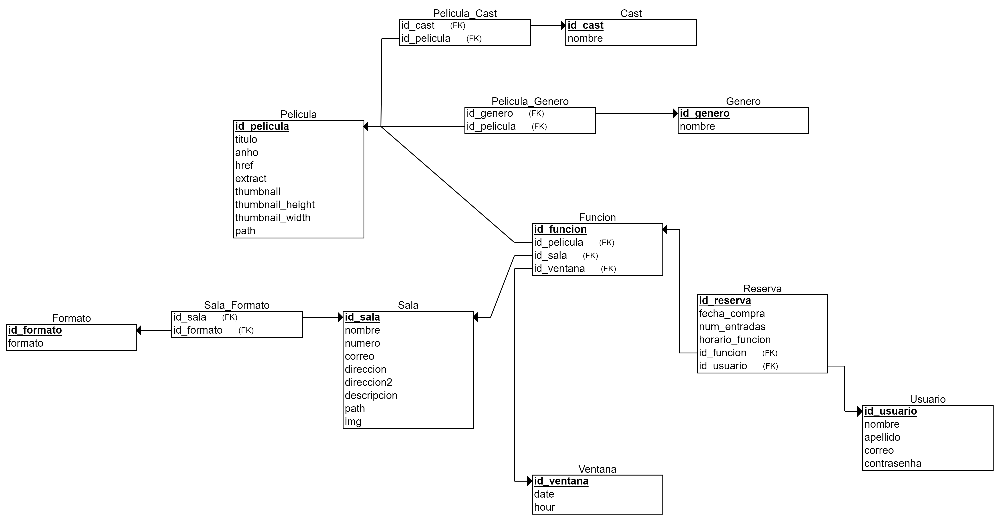

# proyecto-progweb

Repositorio para el proyecto del curso de Programación Web del ciclo 2024-0 en la carrera de Ingeniería de Sistemas.

  

Grupo 2 - Integrantes:
- Alfaro, Lucía
- Amoretti, Jesu
- Leon, Patrick
- Fernández, Italo
- Taype, Daniel

## Deployment 
github-pages: https://jesufrancesco.github.io/proyecto-progweb/  
*\*solo está disponible con el backend de azure*

## Modelo de base de datos

  

---
## Quickstart

### 1. ./client:
- Se instalan los modulos del package.json con `npm install -f`.
- Se inicializa la página con `npm start`.

### 2. Creación de DataBase:
- Se debe crear los datos en base a los datos ubicados en ./config/settings.py.

### 3. ./server:
- Se ha de crear un entorno virtual `python -m venv venv`
- Activar el entorno virtual (windows) `.\venv\Scripts\activate`
- Instalar los requermientos adjuntos `pip install -r requirements.txt`
- En base a los datos configurados en (2), se ha de configurar el `DATABASES["default"]` dentro de `settings.py`
- Ejecutar los comandos básicos de configuración de Django
  - `python manage.py makemigrations`
  - `python manage.py migrate`
  - `python manage.py runserver`

## Caso de host en Nube. (IaaS / PaaS)
Se ha de clonar la rama de <a href="#">main-azure</a> y configurar las siguientes variables de entorno.

| Key | Value |
|-----|---------|
| ALLOWED_HOST_1 | "dominio de Web Api en servicio de nube" |
| CORS_ALLOWED_1 | http://localhost:3000 |
| CORS_ALLOWED_2 | https://api.postmarkapp.com |
| CORS_ALLOWED_3 | ... |
| DATABASE_NAME | ... |
| DATABASE_USER | ... |
| DATABASE_PASSWORD | ... |
| DATABASE_HOST | ... |
| DATABASE_PORT | ... |

